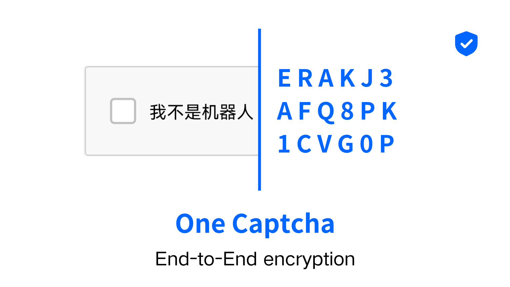
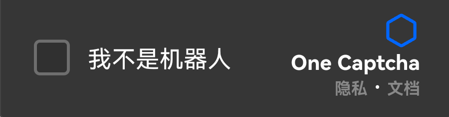
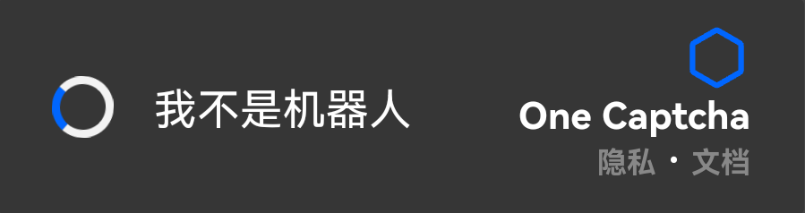
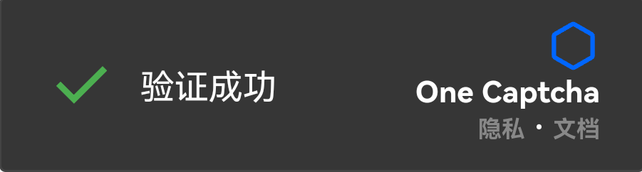
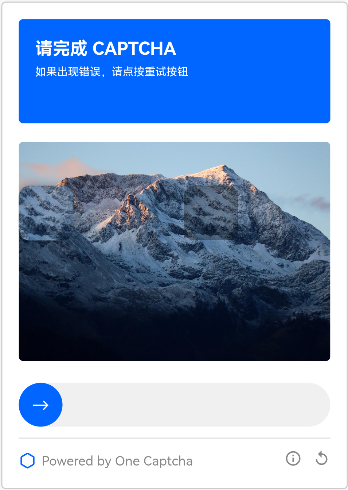

# One Captcha

🤖 **A free human-machine verification product project that is secure and privacy-protecting.** 🎉🔥

- **⭐ GDPR compliant**
- **⭐ Written in JavaScript, easy to understand**
- **⭐ Mobile friendly**
- **⭐ No third-party services**
- **⭐ Open Source**
- **⭐ End-to-end encryption**
- **⭐ Light/Dark Mode**
- **⭐ Multilingual (in development)**

## Preview

**Light Mode**

**Dark Mode**

**Loading**

**Success**

**Slider Captcha**

## Quick Start

[See docs](https://docs.xyehr.cn/docs/one-captcha)

## Project Structure

> - `assets`: Assets Folder
>     - `api`: The folder where the version of the API is stored
>     - `logo`: Folder where LOGO images are stored
>     - `v3`: The folder where the images of the sliding verification code of version v3 are stored
> - `demo`: Demo Folder

## Contributors

## Star History

## Help

[Captcha demo](https://onecaptcha.us.kg/demo/v3-db) | [Docs](https://docs.xyehr.cn/docs/one-captcha) | [Report problem](mailto:evan.huang000@proton.me)

### Contact me

**If you have any questions or suggestions, please contact me by emailing me to ask an issue or submit a request.**

**E-mail:**
**evan.huang000@outlook.com**
**evan.huang000@proton.me**
